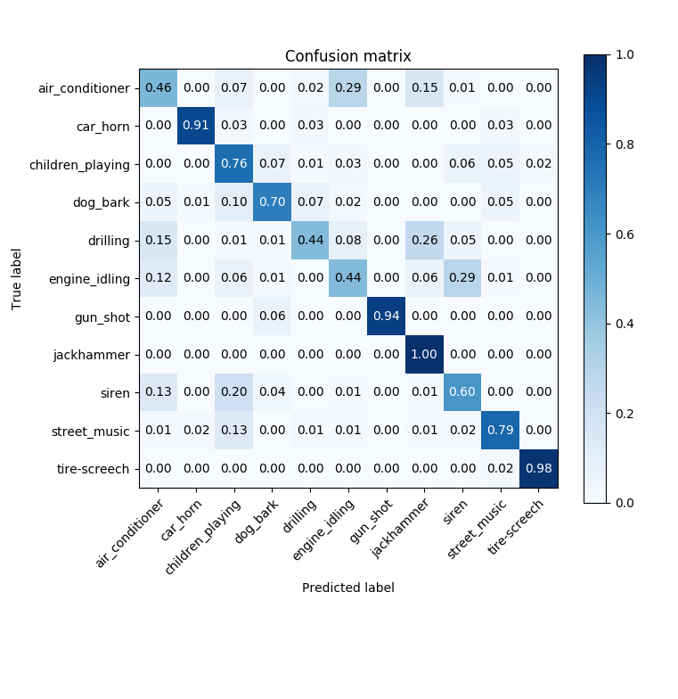

# V2 Sound Classifier v0.3 - Training
This repository is for retraining the sound classifier on your own computer.

The steps below walk you through setting up a python environment, collecting data and training the model.

After this you can evaluate the model's performance or use it to detect recorded sounds in realtime.

For using your (or our) trained model on a raspberry pi, see the repository ...

## 1. Installing python environment
For more experienced python users: the required packages are listed in `requirements.txt`. For users new to Python, read on:

### 1.1 MacOS / Linux
#### 1.1.1 Python3
Download python3 from [here](https://www.python.org/downloads/) if it is not installed.

#### 1.1.2 Dependencies
It's usually a good idea to install the dependencies in a `venv` (short for virtual environmont). This will allow you to install different versions of packages on the same machine. To create a virtual environment:
```
python3 -m venv /path/to/new/virtual/environment
```

Then activate it:
```
source /path/to/new/virtual/environment/bin/activate
```

Then we install the dependencies with pip:
```
pip install numpy scipy llvmlite scikit-image scikit-learn sounddevice tensorflow==1.13.1 Keras==2.2.4 librosa matplotlib Pillow
```

### 1.2 Windows
#### 1.2.1 Python3
Some of the python dependencies such as numpy have to be compiled. Setting up a compiler on Windows can be tricky, so the easiest way to install the python environment on Windows is to use Anaconda. Anaconda allows you to install precompiled binaries from the conda repository.

Download Anaconda Python 3.x distribution from [here](https://www.anaconda.com/distribution/) and install. During the installation you will be asked if you want to add this python interpreter to PATH. Choosing yes will make sure if you type `python` in a command window the Anaconda version will be used, this is the easy option. If you don't want te make the Anaconda python the default one and choose no, it's best to perform the following steps in an *Anaconda prompt* instead of the normal command or powershell window.

#### 1.2.2 Dependencies
Install these dependencies with conda:
```
conda install numpy scipy llvmlite
```

The rest can be installed with pip. But we first install pip inside conda to make sure pip and conda find the same installed packages:
```
conda install pip
```

Then check if the default pip is the Anaconda one:
```
pip -V
```
In the path in the output (e.g. `pip 19.2.3 from D:\Anaconda3\lib\site-packages\pip (python 3.7)`) you can verify if this pip points to the one installed in the Anaconda environment.

Then install the remaining packages:
```
pip install scikit-image scikit-learn sounddevice tensorflow==1.13.1 Keras==2.2.4 librosa matplotlib Pillow
```

Note: if you want to use your GPU, you have to install a number of things like CUDA and cuDNN. See [this page](https://www.tensorflow.org/install/gpu) information how to set up tensorflow with gpu support. You then replace `tensorflow==1.13.1` with `tensorflow-gpu==1.13.1` in the command above. Pay special attention to the versions when installing CUDA and cuDNN, different tensorflow versions ar ecompatible with different CUDA versions. [This list](https://www.tensorflow.org/install/source#gpu) is very helpful for that.

## 2. Data
### 2.1 Available datasets
The best dataset we have been able to find is the [Urban Sounds 8k dataset](https://urbansounddataset.weebly.com/urbansound8k.html). This is compiled from sound recordings uploaded to [freesound.org](https://freesound.org). It consists of 8732 sounds across ten categories which the [SONYC](https://wp.nyu.edu/sonyc) project deem the most important in their research.

The entire dataset can be downloaded [here](https://urbansounddataset.weebly.com/download-urbansound8k.html) (you have to fill in a form) or [here](https://zenodo.org/record/1203745#.XSWOb5MzaL4) without inputting any data.

Note that the SONYC project is compiling an even better dataset from captured audio, and have an active citizen-tagging project running now to classify the sounds. [See here](https://www.zooniverse.org/projects/anaelisa24/sounds-of-new-york-city-sonyc) for info. 

### 2.2 Preprocessing: reordering
The 'Urban sounds 8k' / 'sonyc8k' dataset is organized in folds for training, not by category. To reorganize the data in a folder structure with the classnames as directories, use the script `reorganize_sonyc8k.py`:
```
python3 reorganize_sonyc8k.py -i <path to sonyck8k dataset> -m <path to the dataset's metadata file> -o <output data folder>
```
*Note: run `python3 reorganize_sonyc8k.py --help` for more information about the command line arguments*

### 2.3 Preprocessing: spectograms
The script `load_data.py` reads all the .wav files from the dataset and creates spectogram images. It will create the same folder structure in the output directory as in the input directory.

Usage:
```
python3 load_data.py -d <audio data folder> -m <metadata filepath> -o <spectrogram folder>
```
With
 * `<audio data folder>` the path to the folder containing audio organized in class directories as created by the previous step,
 * `<metadata filepath>` the filepath where to store a new metadata file used by this script, to allow (among others) stopping and continuation of the script and
 * `<sprectrogram folder>` the path where to create the folders with spectrograms.

### 2.4 Split data in train and validation sets
To assess the models classification (and in particular generalization) capabilities we need to reserve a subset of the data, so that we can test it on data that the model has never seen before. So we need a 'validation' folder with spectrograms not in the training set, organized in the same way in class folders. If you use the sonyk8k dataset and have preprocessed it with the scripts above, you can use the following script to split the data:
```
python3 split_data.py -d <spectrogram data folder> -v <validation data folder> -f <fold name>
```
With
 * `<spectrogram data folder>` the path to the folder containing spectrograms organized in class directories as created by the previous step,
 * `<validation data folder>` the filepath where to move the validation samples to
 * `<fold name>` the name of the fold. Default: `fold10`.

*Note: The `reorganize_sonyc8k` script stores the fold name in the samples' filename and this script uses that.*

### 2.5 New data
To train with your own data or to add a category to the model, see ...

## 3. Training
To train the model run:
```
python3 train.py -t <training data folder> -v <validation data folder> -m <model folder> -n <model name>
```

## 4. Evaluation
To evaluate the model run:
```
python3 train.py -t <training data folder> -v <validation data folder> -m <model folder> -n <model name>
```
The model with the added category of 'tire-screech' has a Hamming loss of 0.31 and the following confusion matrix:



## 5. Usage

### 5.1 GUI tool
The script `record_audio_gui.py` shows a GUI figure with the spectrogram, volume, the estimated class probabilities and buttons to stop and start storing the audio files.

When storing sounds, it will only store sounds if the peak volume exceeds the set threshold. It also stores additional information about the file in a json file included in the store folder.

```
python record_audio_gui.py -m <model filepath> -c <classes file filepath> -s <store sounds> -t <threshold> -l <store location>
```
With
 * `<model filepath>` The filepath of the .h5 model for spectrogram classification. (default: models/model_with_tire_screech.h5)
 * `<classes file filepath>` The filepath of the json file containing a list of class names. (default: models/ class_names_with_tire_screech.json)
 * `<store sounds>` Store the recordings that exceeded the volume threshold? ("y"/"n", default: "n")
 * `<threshold>` The volume threshold above which sounds will be stored if store is enabled. (number, default: -30)
 * `<store location>` The location where to store sounds if store is enabled. (default: stored/)

This script is quite demanding for small devices like a raspberry pi. It is adviced to start with this script to test if the audio is working and to choose a suitable volume threshold for storing sounds and then use the next script to start a longer recording:

### 5.2 CLI tool
The script `record_audio_cli.py` does the same but without a GUI window. Usage:

```
python record_audio_cli.py -m <model filepath> -c <classes file filepath> -s <store sounds> -t <threshold> -l <store location>
```
With
 * `<model filepath>` The filepath of the .h5 model for spectrogram classification. (default: models/model_with_tire_screech.h5)
 * `<classes file filepath>` The filepath of the json file containing a list of class names. (default: models/ class_names_with_tire_screech.json)
 * `<store sounds>` Store the recordings that exceeded the volume threshold? ("y"/"n", default: "n")
 * `<threshold>` The volume threshold above which sounds will be stored if store is enabled. (number, default: -30)
 * `<store location>` The location where to store sounds if store is enabled. (default: stored/)

## 6. Adding a sound
The model is hardwired to predict a fixed number of categories. So to add a category, we retrain the whole model with the following steps.

We tested this procedure with a new sound class 'tire screech'. See **step 3** of [steps_taken.md](steps_taken.md) for an evaluation of this process.

### 6.1 Data collection
Collect sounds (wav or mp3) and put them in a new folder in the organized audio data directory (default `data/audio`). Name the folder according to the class name.

Ideally the sounds are longer than 4 seconds and contain only the relevant sound. Shorter samples will be padded and longer samples will be cut in 4 seconds pieces in the next step. If the audio recordings contain long stretches of silence or other sounds, this will pollute the dataset with wrong sound samples.

Try to get sounds from different sources. As a test, we collected 91 sound recordings from three sources:
 * freesound.org
 * youtube
 * netflix
It took approximately 4 manhours to collect, filter and cutout the 91 samples.

### 6.2 Data preprocessing
To generate images from the sounds, rerun the script `load_data.py` from **step 2.3**. It will detect new sounds, convert them to spectrograms ad store them in a new class folder in the spectrograms folder.

### 6.3 Split data
Move a small part (10%) of your new class spectrograms to a folder with the same name in the validation directory (default `data/spectrograms-test/`) to validate the model on.

### 6.4 Retrain model
Run `train.py` with the appropriate parameters (best to specify a new model name, to not overwrite the original one) to retrain the model.
