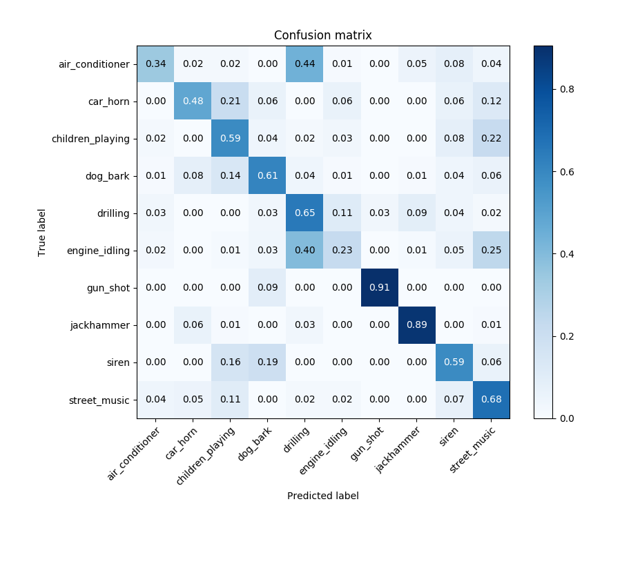
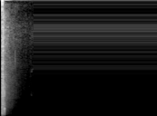
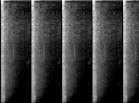
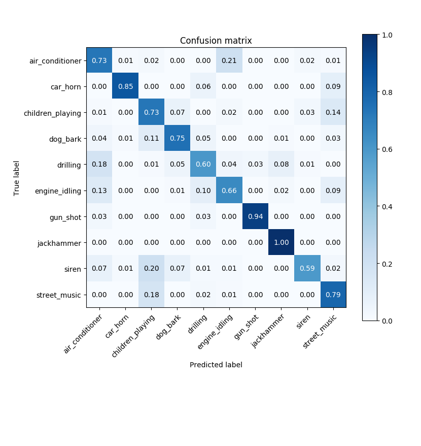
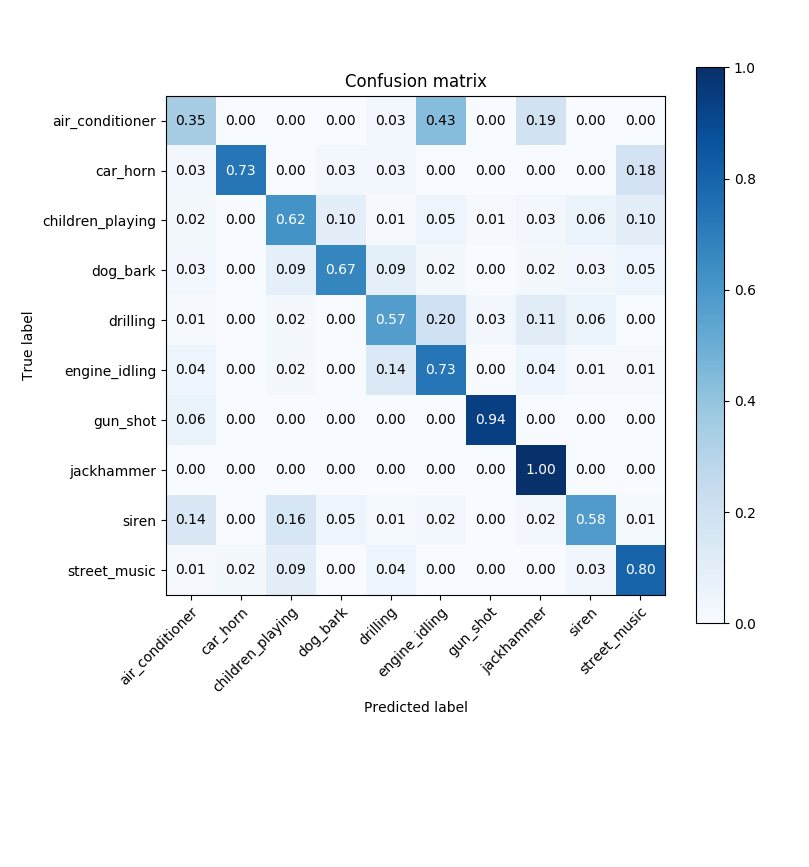
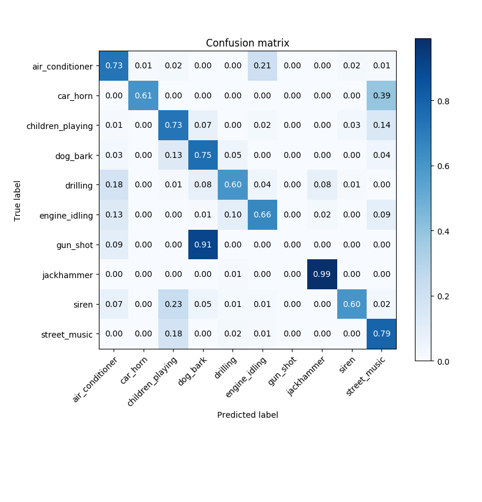
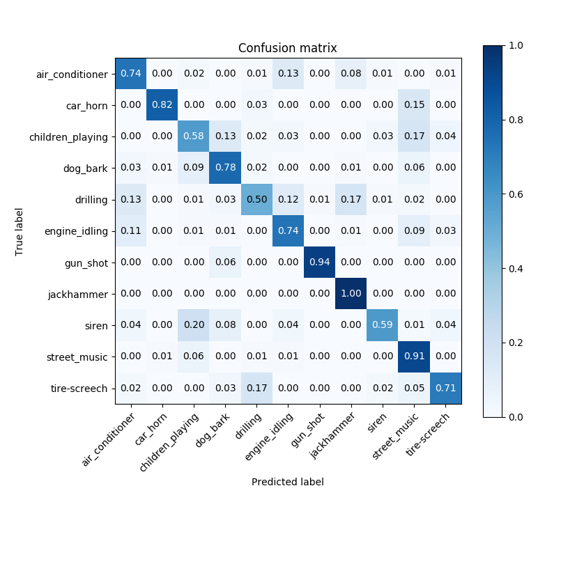
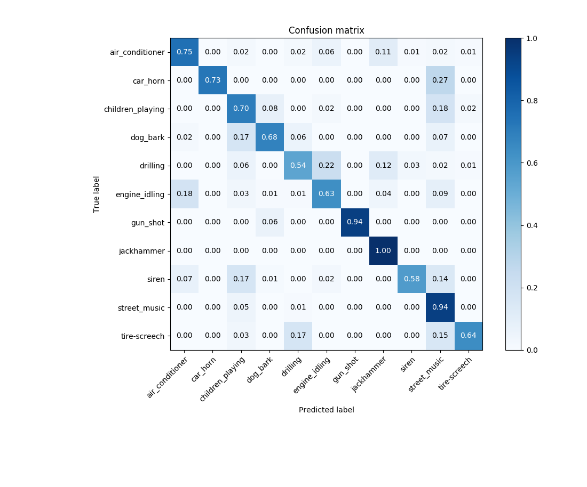
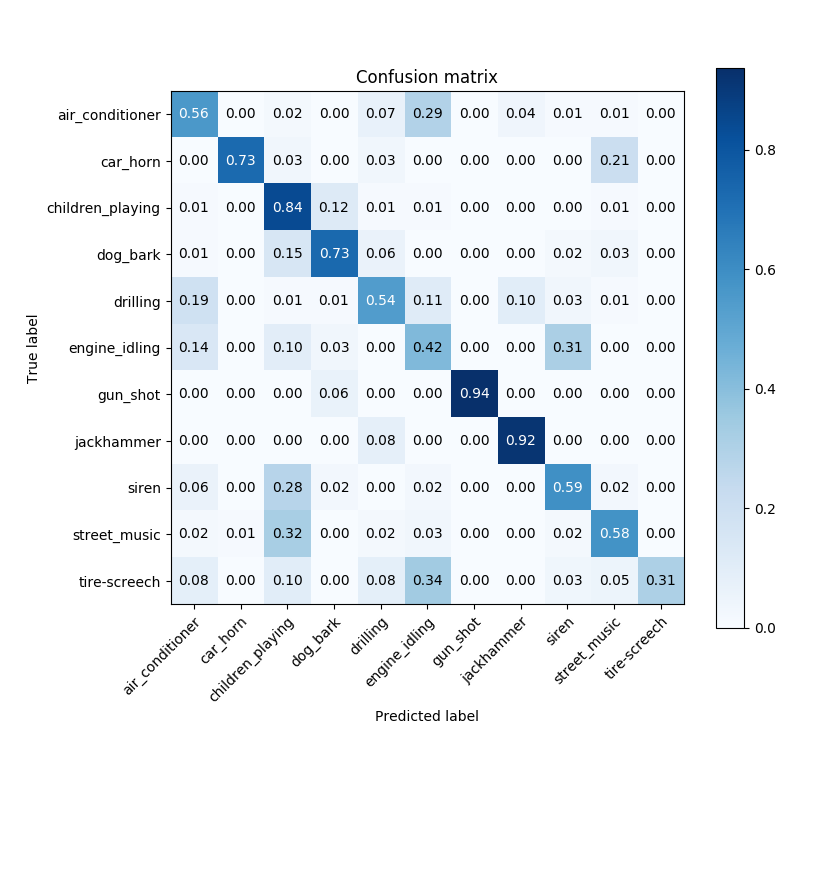

# V2_sound-classifier-0.3: steps taken

This document lists all the steps taken in order to improve the project, starting from the previous version 0.2.

## Step 1. improve current project
The previous combined methodology of preprocessing and classification resulted in a *Hamming loss* of **0.42** and the following evaluation confusion matrix:


### Step 1.1 Preprocessing
The preprocessing consists of transforming the audio files into images for the convolutional neural net.
I noticed two problems with the current workflow:
 1. The sample rate of the audio samples was not taken into account when generating the spectrograms. So the spectrogram bands (the height of horizontal bands in the images) would corresponds to different frequencies in the audio, dependent of sample rate of the audio signal.
 2. Samples too short are padded with silence (black pixels in the images). This is very different than what will occur in the real life application.

The problem with both these things is not only that the accuracy may suffer, but the model can use them to 'cheat'. For instance, a lot of samples in the category 'car_honking' are shorter than 4 seconds. So the model may find out that if an image contains a lot of black pixels on the right side, it's probably a car honking. This will cause the accuracy to appear much higher than it actually is, or will be in a realtime application. The same applies to the sample rate: it may be that sounds of one category have on average a lower sample rate, for instance because they have been uploaded by the same user on freesound.org. The model will then pick up false correlations between the sample-rate distortion effects and catgeories. In a realtime application this will not apply, because all sounds will be recorded with the same quality.

To solve problem 1 I used the python library librosa to load the audio and generate the spectrograms. Librosa automatically resamples the audio to have the same sample rate (22050 Hz), while applying a cut-of filter to reduce aliasing.

To solve problem 2, the most frequently used padding methods are 'zero-padding', 'reflect', 'wrap' and 'nearest'. Th problem with zero padding is outlined above. Reflecting the sample will cause part of the sample to reverse in time. For humans time-reversed sounds often sound very different, so this is not a suitable method either. Wrapping the sample (i.e. repeating from start) seems a good method for sounds like people talking, air conditioner and others. However for instantaneous sounds like 'dog barking' or 'gun shot', this may lead to the model only picking up repeated gun shots if all samples are shorter than 4 seconds. So I tried both methods.

An example of a gunshot padded with 'nearest' method:



An example of a gunshot padded with 'wrap' method:



In addition to these steps I also changed the type of spectrogram to 'mel-spectrogram': the semi-logarithmic type of spectrogram is more widely used for sound recognition.

### 1.1.2 effect on validation performance - wrap

I trained the model first with 'wrap' padding mode. The validation loss stopped improving after 35 epochs:
```
loss: 0.8422 - acc: 0.7203 - val_loss: 0.9687 - val_acc: 0.7404
```
The confusion matrix was improved from the previous version:


And the Hamming loss decreased from 0.42 to **0.31**.

### 1.1.3 effect on validation performance - nearest

With samples padded with 'nearest', the sample stopped improving after epoch 35:
```
loss: 0.6636 - acc: 0.7865 - val_loss: 0.9536 - val_acc: 0.7590
```
The confusion matrix seems even better:



And the Hamming loss even dropped to **0.25**.

But, since wrapping by nearest value produces artefacts in the data, the model may have taken advantage of this.

### 1.1.4 Cross comparison

It is interesting to see how the model trained on one wrapping type performed on data of another type:

**Model *wrap* on data *nearest***

Hamming loss: 0.32




**Model *nearest* on data *wrap***

Hamming loss: 0.30



**Conclusion**

Even though the model trained on 'nearest' data had the best overall accuracy and the smallest Hamming loss, we can see that this model classified *all gunshots* wrong. While the model trained on wrapped data did classify a portion of gunshots right, even though it only saw samples with repeated gunshots. I therefore chose the model trained on 'wrapped' samples to continue with. 

## Step 2. accuracy vs number of samples
To see how the number of training samples affects accuracy, I repeated the training procedure for different fractions of the training set. For each fraction, I took a random subset of the data, so the accuracy varies over the iterations.

Overall, as can be expected, the more samples used the better the accuracy. However, this effect was not as strong as I suspected and even with the only 5% of the data (just 400 samples instead of 8k) the Hamming loss was only 0.56:


The confusion matrices of the smallest (0.05) and largest (0.75) tested fractions:

**Fraction: 0.05, 394 samples, Hamming loss 0.56:**


**Fraction: 0.75, 5920 samples, Hamming loss 0.31:**


**Model collapse**
Sometimes the model would 'collapse': it would suddenly classify all samples as 'air conditioner'. This problem is mitigated by only saving the model when the validation accuracy is improved.

## Step 3. Adding a new sound
The model is hardwired to predict a fixed number of categories. So to add a category, we retrain the whole model with the following steps:

### Step 3.1 Data collection
Collect sounds (wav or mp3) and put them in a new folder under `data/audio`. I Created a folder `data/audio/tire_screech` and put 91 soundfiles there, all at least 4 secods long and from various sources.

### Step 3.2 Data preprocessing
To generate images from the sounds, run the script `load_data.py`. This creates 4 second long spectrograms from all the audio files. Because a lot of the audio files were longer than 4 seconds, this resulted in 829 spectrograms for this category.

### Step 3.3 Retrain model
Run `train.py` with the appropriate parameters to retrain the model.

### Step 3.4 Evalutaion
The model with the added category of 'tire-screech' has a Hamming loss of 0.31 and the following confusion matrix:


We see our new category has a validation accuracy of 0.98! That seems a little *too good* to be true.

### Step 3.5 More critical evaluation
The tire screech sounds where mostly longer than 4 seconds so most recordings are split into several spectrograms. Because the test set was a random sample of spectrograms, it could have been that during training the model already saw other spectrograms from the same recording as in the test set, giving it an unfair advantage. So I split the train-test set for this category again by hand, and this time I made sure that all the test samples are from a different recording than the ones in the training set.

I copied all the sounds recorded from Netflix (*Need 4 Speed*) and the spectrograms generated from one long recording from freesound.org (*165076__pawelbas__race-car-subaru-screeching-tires*) to the test folder and ran train.py again.

This time the Hamming loss was even lower, 0.26. In the confusion matrix we see that the accuracy for the new category tire screech dropped to 0.71. This result is still not bad at all, knowing that the model recognized these test samples based on other audio samples from other sources.



### Step 3.6 New category accuracy vs number of samples
*What if we would have trained with only the 30 recordings from youtube?*

Then the accuracy for tire screeches is slightly lower, at 0.64:



*Or only 10 recordings?*

That's not enough. The accuracy for tire screeches then drops to 0.31:



